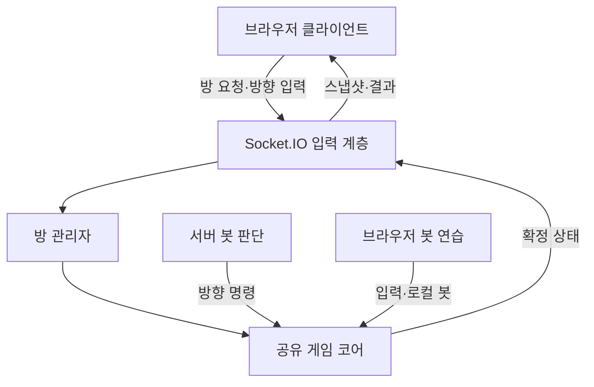
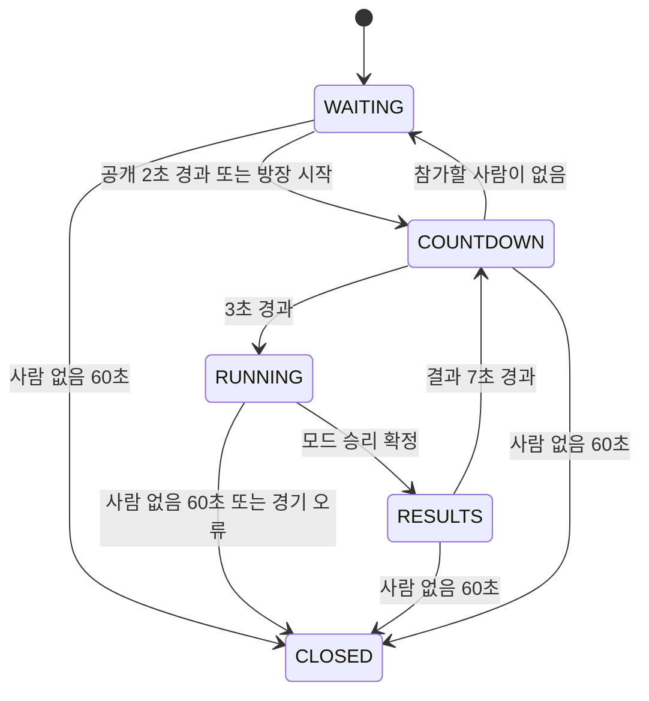

# TECH_SPEC — 육각형 영토 점령 멀티 게임

버전: 0.5 / 작성일: 2026-09-30 / 수정일: 2026-10-01 / 상태: 영토와 꼬리 연결 단절·전장 축소·미세 조작 안정화 반영

기준 문서: PRD.md v0.5. 작성 당시의 설계 전용 문장과 이후 사용자 구현 요청을 구분한다. 2026-10-01 기존 규칙 개편에 이어 영토와 꼬리 연결 단절·전장 축소·미세 입력 안정화를 반영했다. 시간제·거점 점수 규칙은 별도 legacy 코드에 보존하며 현재 모드에서는 사용하지 않는다.

## 1. 설계 요약

하나의 TypeScript 프로젝트에서 브라우저 클라이언트, Node.js 서버, 공유 게임 규칙을 관리한다. 온라인에서는 단일 서버 프로세스가 모든 판정을 수행하고, 연습에서는 같은 규칙을 브라우저에서 실행한다. 방과 경기 데이터는 메모리에만 저장한다.

| 결정 | 이유 |
|---|---|
| 단일 저장소·단일 package.json | 개인 개발에서 여러 패키지 배포·빌드 연결을 관리할 필요가 없음 |
| 순수 TypeScript 게임 코어 | 서버·연습이 동일한 규칙을 사용하고 렌더러 없이 판정 테스트 가능 |
| Phaser는 표시와 입력에 사용 | 육각형 규칙을 Phaser 물리 엔진에 묶지 않고 서버에서도 동일하게 실행 |
| 서버 최종 판정 | 각 기기의 화면·프레임 속도가 승패를 결정하지 않음 |
| Socket.IO + 전체 상태 스냅샷 | 작은 맵·8명 규모에서 복잡한 변경분 재전송보다 구현·복구가 단순 |
| 단일 Node.js 프로세스 + 메모리 방 | 초기 이용자 수에 맞는 운영 규모; DB·Redis·분산 락 불필요 |
| 규칙 기반 봇 | 비용·학습 데이터 없이 네 가지 성격을 구현·검증 가능 |

### 1.1 MVP 제외 항목

React, Next.js, ORM, 데이터베이스, Redis, 마이크로서비스, Kubernetes, 자체 바이너리 프로토콜, 이벤트 영구 저장, 서버 과거 상태 되감기, 학습형 AI는 도입하지 않는다. 안드로이드 패키징·대시·도전 모드는 후속이다.

## 2. PRD의 모호한 부분에 대한 기본안

PRD를 수정하지 않고 다음 해석을 기술 설계의 기본안으로 적용한다. 사용자 검토에서 변경되면 게임 규칙·검증 항목을 함께 갱신한다.

| 항목 | 적용할 해석 |
|---|---|
| 공개 대전 대기 5초와 카운트다운 3초 | 5초에 카운트다운 포함. 첫 입장 후 2초 모집, 이어 3초 카운트다운 |
| 다음 판 선택과 자동 시작 | 방에 남아 있는 사람은 기본적으로 다음 판 참가. 버튼은 참가 확인이며 나가기를 누르면 제외 |
| 결과 표시 10초 | 다음 라운드 카운트다운 포함. 결과 7초 + 카운트다운 3초 |
| 꼬리 접촉 범위 | 노출된 선이 차지한 육각형에 캐릭터의 논리적 중심점이 진입하면 접촉. 시각 선도 칸을 충분히 채워 범위를 표시 |
| 이동 방향 | 입력은 목표 방향. 실제 방향은 공용 stepSteering으로 매 tick 최대 9rad/s 회전한 뒤 이동 |
| 보호의 효력 | 자기 선이 없는 시작 구역에 머무를 때 적용. 시작 구역 소유권을 잃거나 밖으로 나가면 종료. 영토 완전 소멸은 탈락 |
| 동시에 정확히 같은 사건 | 틱 내부 사건 시간을 1마이크로초 단위로 묶어서 동시로 취급. 이 묶음에서는 절단이 복귀보다 우선 |
| 연결 유예 10초 | 서버가 연결 상실을 감지한 시점부터 계산. 물리적 단절을 즉시 알아내는 것은 보장하지 않음 |
| 연습의 오프라인 의미 | 최초 클라이언트 로드 이후 서버 없이 진행. 파일 자체의 오프라인 설치·캐시는 후속 |
| 진행 중 친구 방 입장 | 전장 데이터를 받지 않는 다음 판 대기자. 사람 정원 계산에는 포함 |

MVP 선 판정은 가느다란 곡선과 캐릭터 원 사이의 정밀 물리 충돌이 아니다. 칸 단위 판정은 육각형 점령 규칙과 일치하고 오래된 선을 찾는 비용도 작다. 화면에서 얇은 선만 그려 판정 범위를 오해하게 만들지 않는다. 실제 플레이 테스트에서 부당하게 느껴지면 PRD와 이 설계를 함께 조정한다.

## 3. 기술 선택과 버전 정책

### 3.1 기술 구성

| 영역 | 선택 | 선택 이유 |
|---|---|---|
| 실행 환경 | Node.js 24 LTS | 지원 중인 LTS 기반으로 개발·운영 통일 |
| 언어 | TypeScript, strict 활성화 | 상태·프로토콜 오류를 줄이고 클라이언트·서버 타입 공유 |
| 화면 | Phaser 3 계열 안정 릴리스 | 필요한 2D 렌더링·카메라·입력 기능과 문서가 충분; 첫 버전은 기능을 제한하여 사용 |
| 웹 개발·빌드 | Vite의 Node 24 호환 안정 릴리스 | 빠른 개발 실행, TypeScript 웹 번들, 프레임워크 없는 구성 |
| HTTP·정적 파일 | Express 5.x | 클라이언트 파일·헬스 체크·오류 처리를 작게 구성 |
| 실시간 통신 | Socket.IO 4.x와 동일 계열 socket.io-client | 연결·이벤트·방 전송을 직접 다시 구현하지 않음 |
| 개발 실행 | tsx, concurrently | TS 서버 개발 실행과 클라이언트·서버 동시 시작 |
| 코어·통합 검증 | Node 24와 선택한 Vite에 호환되는 Vitest 안정 릴리스 | 공유 TS 규칙과 서버 테스트를 하나의 도구로 관리 |
| 브라우저 검증 | Playwright 안정 릴리스 | 서로 다른 브라우저 컨텍스트와 모바일 화면·입력 확인 |
| 후속 안드로이드 | Capacitor + Android Studio | 웹 클라이언트를 활용; 이번 MVP에는 패키지·설정 추가하지 않음 |

Phaser는 브라우저 2D 표시와 입력을 담당하며, 렌더링과 규칙의 책임 분리는 이 프로젝트의 선택이다. Express에는 DB나 인증 체계를 추가하지 않는다. [S1][S6]

### 3.2 버전 고정

- 문서 작성 시 공식 릴리스 표에서 Node 24는 LTS다. Vite·Vitest의 현재 문서 요구사항에도 맞는 실행 환경으로 선택한다. [S2][S3][S7]
- Phaser 3 계열은 설계 기준이지 최신 버전이라는 주장이 아니다. 구현 시작 시 해당 계열의 지원 상태·의존성 호환성을 확인한다. 확인 결과 다른 메이저가 필요하면 변경 이유를 기록한다.
- 패키지의 정확한 패치 버전은 구현 시작 시 공식 배포 정보로 확인하고, package.json과 package-lock.json에 고정한다. 현재 설치하거나 검증한 버전은 없다.
- Node의 정확한 버전도 .node-version과 README에 기록하고 개발·CI·운영을 맞춘다.
- CI·재현 설치에는 npm ci를 사용한다. 실행 때마다 latest를 받아오지 않는다.
- TypeScript 정적 타입만으로 외부 네트워크 데이터를 신뢰하지 않는다. 입력 검증은 별도로 한다.

## 4. 구조와 책임 분리

### 4.1 실행 구조

공유 게임 코어는 브라우저와 서버에 각각 로드되는 동일 소스다. 연습이 온라인 서버의 게임 인스턴스에 접근한다는 의미는 아니다.

### 4.2 제안 파일 구성

| 경로 | 책임 |
|---|---|
| index.html | 웹 진입점 |
| src/shared/config.ts | 초기 수치·상한·프로토콜 버전 |
| src/shared/hex.ts | 육각형 좌표·인접·이동 경로의 칸 통과 |
| src/shared/model.ts | 경기·참가자·입력·사건 타입 |
| src/shared/game.ts | 고정 틱과 사건 순서 |
| src/shared/territory.ts | 점령·소유권 변경·영토 개수 |
| src/shared/spawn.ts | 안전 등장 위치·보호 |
| src/shared/bot.ts | 관측·목표·경로·방향 선택 |
| src/shared/protocol.ts | 전송 타입·검증 규칙·오류 코드 |
| src/client/main.ts | 앱 초기화 |
| src/client/game-scene.ts | Phaser 맵·캐릭터·선·카메라·미니맵 |
| src/client/ui.ts | DOM 메뉴·HUD·결과·오류 안내 |
| src/client/input.ts | 키보드·마우스·터치 입력 통합 |
| src/client/session.ts | 화면 전환·모드 선택·컨트롤 상태 |
| src/client/network.ts | Socket.IO 연결·스냅샷 수신·시계 추정 |
| src/client/practice.ts | 서버 없는 로컬 코어 실행 |
| src/server/index.ts | Express·Socket.IO·프로세스 수명주기 |
| src/server/rooms.ts | 방·대기·시작·결과·인원 보충 |
| src/server/sessions.ts | 익명 세션·재연결·요청 중복 방지 |
| src/server/loop.ts | 단일 스케줄러·방별 시뮬레이션 |
| src/server/transport.ts | 입력 검증·직렬화·방 전송 |
| tests/core, tests/server, tests/e2e | 판정·실제 통신·화면 검증 |

이 파일들은 구현 시 필요에 따라 묶을 수 있다. 빈 추상화 계층, 의존성 주입 프레임워크, 모든 모듈에 대한 별도 클래스를 만들 필요는 없다.

### 4.3 공유 코어 계약

- createMatch(config, seed, participants, matchId?, gameMode?): 경기와 사전 계산된 맵 생성; 기본 모드 classic.
- stepMatch(match, inputs): 정확히 한 고정 틱 진행, 상태를 변경하고 표현용 사건 반환.
- getBotInput(observation, botMemory): 일반 참가자와 같은 방향 입력 반환.
- buildView(match): 네트워크·연습 화면에 필요한 공개 상태 추출.
- computeResults(match): 확정 상태에서 순위·통계 계산.

시간·입력·난수 시드를 외부에서 전달한다. 코어 안에서 Date.now, Math.random, DOM, Phaser, Socket.IO, Node 전용 API를 호출하지 않는다. 동일 시드와 틱별 입력으로 같은 실행 환경에서 결과를 재현한다. 브라우저와 서버 간 비트 수준 부동소수점 결정성은 네트워크 동기화의 전제가 아니다.

## 5. 데이터 모델과 설정

### 5.1 주요 모델

| 모델 | 주요 필드·규칙 |
|---|---|
| MapDefinition | mapId, radius, cellCount, q/r 목록, 중심 좌표, 6방향 이웃, 경계 변, 거점 중심 칸 |
| MatchState | matchId, seed, tick, elapsedTicks, config, participants, owners, trailMasks, controlPoints, 결과 상태 |
| 모드 상태 | gameMode: 확정 mode id·설정, modeState.holds: participantId·startedAtTick·endsAtTick, outcome: winnerId·reason·atTick |
| Participant | participantId, slot 0~7, kind HUMAN/BOT, nickname, position, cellId, direction, targetDirection, lifeId, lifeState |
| 생명·점수 | trailCells, territoryCount, controlScore, kills, deaths, respawnAtTick, protectedUntilTick, spawnCells |
| 방향 입력 | matchId, lifeId, seq, dx, dy; 참가자 식별자는 서버 세션에서 결정 |
| ControlPoint | pointId, cellId; 소유자는 owners[cellId]에서 도출 |
| Room | roomId, mode, friendCode, phase, members, hostId, phaseDeadline, match, nextRoundNumber |
| 방의 모드 | mode는 PUBLIC/FRIEND, 별도 readonly gameMode는 classic/hold. 생성 시 설정을 검증·동결하고 다음 판에도 재사용 |
| HumanMember | memberId, sessionId, joinOrder, connected 상태, 유예 마감, waitingForNextRound |
| Session | 불투명 재연결 토큰, 현재 소켓, 방 멤버십, 요청 캐시, 유효기간; 전송 공개 상태에 포함하지 않음 |

participantId와 socket.id는 분리한다. 소켓이 바뀌어도 같은 인간 멤버와 현재 참가자로 복구한다. lifeId는 재등장마다 증가하여 이전 생명의 입력을 새 생명에 적용하지 않는다. 이탈자를 대체한 봇에는 새로운 participantId를 발급한다.

### 5.2 소유권·선 표현

- owners: Uint8Array(cellCount), 0은 중립, 1~8은 현재 슬롯 + 1.
- trailMasks: Uint8Array(cellCount), 비트 0~7이 각 슬롯의 노출된 선 존재를 나타낸다.
- 참가자는 고유 trailCells 집합을 갖는다. 자기 선 교차 시 같은 칸을 중복 추가하지 않는다.
- 같은 칸에서 여러 선이 생기는 동시 사건을 처리하기 위해 한 소유자 값 대신 비트 마스크를 사용한다.
- 슬롯은 경기 동안 참가자 수를 제한하는 인덱스다. 캐릭터 identity는 participantId로 구분하고 슬롯 재사용 전에 이전 영토·선·클라이언트 표시를 제거한다.
- territoryCount는 소유권 변경 함수에서 이전 소유자와 새 소유자를 함께 갱신한다. 개발 검증에서는 배열 재계산과 일치하는지 확인한다.
- 서버 내부 Set/Map을 네트워크 JSON으로 직접 전송하지 않는다.

### 5.3 초기 설정

| 설정 | 값 |
|---|---|
| simulationHz / snapshotHz / inputMaxHz | 30 / 10 / 30 |
| maxSlots | 8 |
| Classic / Hold 시간 제한 | null / null |
| DEFAULT_HOLD.targetPercent / holdSeconds | 50 / 10; src/shared/modes.ts에서 중앙 관리 |
| roundSeconds (legacy 전용) | 240; Classic/Hold의 종료·재등장에는 사용하지 않음 |
| mapRadius / hexSideWorldUnits | 22 / 32 |
| spawnRadius / spawnCellCount | 2 / 19 |
| moveCellsPerSecond | 4.2 |
| turnRadiansPerSecond | 9 |
| respawnSeconds / protectSeconds / retrySpawnSeconds | 3 / 2 / 1 |
| spawnBufferHexes | 3; 후보 시작 구역의 모든 칸에서 상대 중심·선까지 최소 3칸 |
| botDecisionMs / botObservationRange | 200 / 육각형 거리 12 |
| interpolationMs / maxExtrapolationMs | 100 / 100 |
| publicRecruitSeconds / countdownSeconds | 2 / 3 |
| resultsSecondsIncludingCountdown | 10 |
| reconnectGraceSeconds / emptyRoomTtlSeconds | 10 / 60 |

초당 4.2칸 속도는 인접 칸 중심 간 거리 × 4.2로 환산한다. 빠르다는 사용자 피드백으로 이전 6칸에서 30% 낮췄다. 서버가 시작할 때 값의 범위와 관계를 검증하고, 경기마다 확정 설정을 스냅샷에 포함한다. 경기 중 환경 변수 수정으로 수치를 바꾸지 않는다.

## 6. 육각형 맵과 이동

### 6.1 좌표와 맵

- 꼭짓점이 위쪽에 있는 pointy-top 육각형, axial 좌표 (q,r)를 사용한다.
- s = -q-r, max(abs(q), abs(r), abs(s)) ≤ 22인 칸을 플레이 영역으로 둔다.
- 칸 수는 1 + 3R(R+1) = 1,519로 PRD의 약 1,500칸에 맞는다.
- cellId는 r 오름차순, 이어 q 오름차순으로 고정한다.
- 6방향 이웃은 (1,0), (1,-1), (0,-1), (-1,0), (-1,1), (0,1).
- 한 변 길이 a=32일 때 x=√3·a·(q+r/2), y=3a·r/2. 인접 중심 거리는 √3·a다.
- 거점 중심 좌표는 (-8,0), (0,8), (8,-8)로 시작한다. 세 거점은 회전 대칭이며 시작 영토에 포함되지 않는다.
- 칸 꼭짓점·이웃·맵 외곽 변은 최초 생성 시 계산하고 캐시한다.

초기 참가자 위치는 외곽 거리 약 17인 후보에서 서로 충분히 떨어진 8개 anchor를 고정 데이터로 선정한다. 19칸 시작 영역의 겹침·거점 포함·외곽 이탈을 검증한다. 참가자를 anchor에 배치하는 순서는 라운드 시드로 섞는다. 8명과 거점 3개의 모든 거리 조건이 완전히 같다고 주장하지 않으며, 거점 접근 시간은 플레이 테스트로 평가한다.

### 6.2 연속 이동과 칸 통과

- 입력을 정규화해 targetDirection에 저장한다. direction은 매 tick 목표를 향해 최대 turnRadiansPerSecond/s 회전한 뒤 고정 속도로 이동한다. 길이가 거의 0인 입력은 무시하고 마지막 목표를 유지한다.
- 서버는 해당 틱의 시작 위치에서 끝 위치까지 직선 구간을 계산한다.
- 현재 육각형의 6개 변과 이동 구간을 교차 검사하여 다음 진입 칸과 틱 내부 진입 시간을 얻고, 끝 위치까지 반복한다.
- 시작·끝 칸만 비교하거나 렌더 프레임마다 점을 찍어서 칸을 생략하지 않는다. 꼭짓점 근처의 짧은 칸 통과도 처리한다.
- 경계 위의 좌표는 이동 방향으로 아주 작은 표본을 찍어 진행할 칸을 정한다. 정확한 동률은 cellId로 결정한다. HEX_EPS=1e-7 세계 단위와 사건 시간 양자화 기준은 공유 상수다.
- 기하 추적은 외곽 변의 충돌 시각 boundaryT와 그 직전의 맵 내부 위치를 반환한다. 엔진은 그 시각을 칸 진입과 같은 시간 축에 넣어 WALL_HIT 탈락을 적용한다. 클라이언트 예측은 경계 안으로 제한하며 탈락을 로컬에서 확정하지 않는다.
- 캐릭터의 논리적 충돌 크기는 중심점이다. 원형 스프라이트 반지름은 시각 표현이며 원작의 정밀 히트박스를 복제한다는 의미가 아니다.

초기 속도·틱에서는 보통 소수의 칸 진입만 생긴다. 이상한 입력·수치로 무한 순회하지 않도록 틱당 진입 사건 상한 64를 두고 초과 시 해당 경기를 오류 종료·로그 기록한다. 정상 경기에서 이 상한에 닿으면 판정 버그로 취급한다.

## 7. 고정 틱과 충돌 사건 순서

### 7.1 시간 관리

- 재등장·보호는 틱으로 관리하고 Hold 시작/완료는 틱 내부 사건 시각도 포함한다. 두 모드의 경기 종료 시한은 없다.
- 서버는 performance.now 기반 누적기로 1/30초 step을 진행한다. 여러 방을 하나의 스케줄러에서 순회하며 비동기 작업을 코어 step 안에 넣지 않는다.
- 한번의 스케줄러 실행에서 방당 최대 5틱만 따라잡고 누적 시간은 버리지 않는다. 일정 시간 지속해 밀리면 신규 방 수용을 중단하고 경고를 기록한다.
- 3초 이상 밀린 경기는 수천 번의 일괄 이동 대신 SERVER_OVERLOAD로 중단하고 결과를 확정하지 않는다. 정상 라운드 시간 준수 여부는 측정으로 확인한다.
- 서버 단절 유예·빈 방 정리는 단조로운 실제 시간으로 계산하여 경기 지연으로 늘어나지 않게 한다.

### 7.2 한 틱의 처리

1. 방 멤버십 변경·유예 만료 등 대기 중 명령을 적용한다.
2. 재등장이 가능한 참가자에게 안전한 위치를 찾는다. 보호 만료를 갱신한다.
3. 사람의 최신 유효 방향과 이번에 판단할 봇 방향을 채택한다.
4. 모든 살아 있는 참가자의 이번 틱 이동 구간과 칸 진입 사건을 계산한다.
5. 진입·복귀·선 접촉·벽 충돌을 틱 내부 시간 순으로 처리한다. 소유권 변경으로 현재 칸 상태가 바뀌면 같은 시간의 파생 사건도 처리한다.
6. 각 사건 시각의 파생 사건이 안정된 뒤 모드 상태·승리를 평가한다. Hold 만료 시각도 이동 사건들과 같은 시간 순 목록에 넣는다. 거점 점수는 지급하지 않는다.
7. 틱·통계 갱신, 스냅샷용 공개 상태 생성 여부를 판단한다.

참가자가 틱 중간에 죽으면 이후 그 참가자의 이동 사건은 폐기한다. 틱과 lifeId를 붙여 이전 생명의 예약 사건을 적용하지 않는다. 정상 재등장과 안전 구역 재시도는 틱 시작에만 수행한다.

### 7.3 같은 시간의 처리 규칙

사건 시간은 틱 내부 정규화 값에서 1마이크로초 단위로 반올림한다. 같은 시간 묶음은 다음 순서로 처리한다.

1. 모든 캐릭터 위치·진입 칸을 그 시간으로 전진시키고, 직전 확정 상태를 기준으로 잠정 새 선과 복귀 후보를 수집한다.
2. 기존 선과 이번에 생길 잠정 선에 대해 모든 살아 있는 비보호 캐릭터의 중심 칸 접촉을 함께 수집한다. 같은 칸에서 본체끼리 닿는 것만으로는 사망하지 않으며, 선이 생기는 경우에만 절단 조건이 생긴다.
3. 절단으로 죽을 참가자를 집합으로 확정한 후 동시에 탈락 처리하고, 같은 시간에 외곽 벽에 충돌한 생존자도 탈락시킨다. 같은 참가자가 절단과 벽 충돌을 동시에 당하면 TRAIL_CUT을 원인으로 기록하며 유효 절단에 제거 횟수를 준다. 벽 충돌만으로는 제거 횟수를 주지 않는다. 사망자의 영토·선과 복귀 후보를 제거한다.
4. 살아남은 참가자의 잠정 선을 적용한다. 같은 시간의 복귀 후보는 7.3.1절에 따라 점령한다.
5. 영토 수가 0이 된 참가자를 탈락 처리하고 소유권·선을 정리한다. 영토 소멸에는 제거 횟수를 부여하지 않는다.
6. 현재 칸을 빼앗겼거나 중립화되어 영토 밖이 된 생존자는 그 칸에 선을 생성한다. 영토에 들어온 채 선을 갖고 있으면 복귀 후보가 된다. 새 선이 다른 캐릭터 중심 칸과 겹치면 같은 시간에 다시 절단 묶음을 처리한다.

파생 사건은 상태가 바뀐 참가자만 다시 평가한다. 한 사건 시점에서 같은 참가자의 동일 조건을 반복 생성하지 않도록 processed 상태를 갖고, 반복 상한을 넘으면 오류 종료한다. 점령으로 상대가 서 있는 칸을 얻은 사실만으로 상대를 죽이지 않는다. 이후 새 선 접촉·영토 소멸 같은 별도 조건이 있어야 한다.

한 선을 같은 순간에 여러 공격자가 절단하면 제거 횟수는 한 명에게만 준다. 해당 라운드의 시드로 미리 정한 참가자 우선순위를 사용한다. 동시에 죽은 공격자도 그 시점의 유효 절단에 대한 횟수는 받을 수 있다. 접속 패킷 도착 순서로 우선순위를 정하지 않는다.

#### 7.3.1 동시 점령의 충돌

- 같은 시간에 살아남은 복귀자들의 점령 후보는 절단 처리 이후의 같은 소유권 기준으로 계산한다.
- 여러 후보가 같은 칸을 요구하면 라운드 시작 시 시드로 섞은 참가자 우선순위에서 앞선 참가자가 얻는다.
- 전체 칸의 최종 소유자를 먼저 정한 뒤 한 번에 적용한다. 참가자 순회 과정의 중간 영토 수 0을 보고 탈락시키지 않는다.
- 소유권 이전·선 마감 전에 최종 winning cell과 trailMasks를 대조하여 노출된 상대 선을 덮는 절단 목록을 확정한다. 실제로 칸을 얻은 참가자만 공격자로 등록한다. 노출 중인 비복귀자의 선과 자기 소유 칸이 6방향 인접해 연결돼 있었는지도 기록한다.
- 영토를 잃은 참가자에 대한 점령자 집합을 보존한다. 전체 소유권 이전·분리 영토 정리 후, 이전에 연결돼 있던 노출 선이 남은 자기 영토와 더 이상 인접하지 않으면 연결 절단 목록에 넣는다. 실제 선 칸을 점령하지 않고 연결 영토만 빼앗거나 중립화해도 적용한다. 같은 순간 유효 복귀를 완료한 참가자는 새 연결 검사에서 제외한다.
- 전체 소유권 이전·분리 정리·복귀 선 마감/CAPTURE 사건 이후 절단 목록을 TRAIL_CUT으로 탈락 처리한다. 직접 선을 덮은 공격자와 연결 영토를 끊은 공격자를 합쳐 시드 우선순위로 처치자 하나를 정한다. 이번 묶음에서 죽는 점령자도 다른 유효 절단의 처치 횟수를 받을 수 있다. 사망자가 이번에 얻은 칸은 중립화하고 재분배하지 않는다. 남은 영토 0 처리와 모드 승리 평가는 그 다음이며 사망자의 Hold 상태는 즉시 제거한다.
- 모든 소유권 변경 적용 후 영토를 잃은 참가자의 6방향 연결 성분을 BFS로 계산한다. 가장 큰 성분만 남기고 다른 성분을 중립화한 다음 영토 소멸을 판정한다. 크기 동률은 가장 낮은 cellId를 가진 성분으로 결정한다. 순회 도중의 중간 소유권으로 정리하지 않는다. 해당 시점에 죽은 참가자의 칸은 중립화하며 이로 인해 같은 칸을 재분배하지 않는다.
- 재등장 위치와 거점 점수는 확정된 소유권만 사용한다.

### 7.4 모드 승리와 경계 시간

- `src/shared/modes.ts`의 작은 `GAME_MODES` 테이블이 설명·규칙·거점 활성 여부·시간 제한·승리 평가를 관리한다. 별도 플러그인 프레임워크는 만들지 않는다.
- Classic은 ALIVE 참가자의 territoryCount가 전체 맵 칸 수와 정확히 같을 때 FULL_CAPTURE를 반환한다. 임의의 점유율 보정은 없다.
- Hold는 ALIVE 및 `territoryCount * 100 >= totalCells * targetPercent` 조건을 사용한다. 새 달성은 startedAtTick을 현재 사건 시각으로 기록하고, 기간은 `max(1, ceil(holdSeconds * simulationHz))`틱이다. 미달·사망 시 해당 진행 상태를 제거하며 재달성은 새 interval이다.
- 정수 틱 안의 사건 시각을 포함해 매번 파생 사건이 안정된 뒤 평가한다. Hold 만료를 같은 사건 시간 목록에 예약하며 양자화한 키와 정확한 만료 시각을 함께 유지한다. 같은 시각의 절단·벽·점령·영토 소멸이 승리보다 먼저다.
- 여러 유지자가 있으면 가장 이른 완료 시각이 승리하고 동률은 시드 우선순위다. 서버 입력은 방향만 허용하므로 클라이언트가 승리·소유권·유지 시간을 제출할 수 없다.
- `finishMatch`는 RUNNING에서 한 번만 outcome·results를 확정하고 선을 정리한다. 즉시 확정 스냅샷과 결과를 전송한다. 이후 step·입력은 결과를 바꾸지 않는다.
- 기존 `legacy-scoring.ts`에 시간제·거점 지급·총점 계산을 보존한다. Classic/Hold 런타임에서 호출하지 않는다. roundSeconds 설정도 재사용을 위해 보존한다.

## 8. 영토 점령 알고리즘

### 8.1 외부 연결 탐색

작은 고정 맵에서는 flood fill로 처리한다. 모든 칸에 대한 탐색은 한 점령당 O(N+E), N=1,519, 육각형 이웃은 최대 6개다.

1. 복귀하는 참가자의 현재 소유 칸과 이번 trailCells를 통과 불가능한 장벽으로 취급한다. 다른 참가자의 영토·선은 장벽으로 취급하지 않는다.
2. 플레이 맵 바깥에 육각형 한 겹의 가상 중립 칸을 추가한다. 가상 칸은 이동·소유·표시 대상이 아니며 외부 연결 판정에만 쓴다.
3. 가상 외곽 모든 칸에서 시작하여 장벽이 아닌 칸을 6방향 BFS로 방문한다.
4. 방문되지 않은 실제 맵 칸의 연결 성분을 구한다. 이번 이동선에 인접한 성분만 이번 점령의 내부 영역으로 선택한다. 무관한 기존 구멍을 별도의 복귀로 가져오지 않는다.
5. 점령 후보 = 이번 이동선 칸 ∪ 선택된 내부 영역. 이미 자기 소유인 칸은 중복 처리하지 않는다.
6. 7절의 순서에 따라 최종 소유권을 적용하고 해당 참가자의 선을 마감한다.

### 8.2 가장자리와 분리된 영토

- 가상 외곽은 항상 외부와 연결되어 있다. 자기 영토와 선으로 막히지 않은 가장자리 성분은 외부 탐색에 방문되어 내부 영역이 되지 않는다.
- 맵 외곽 자체를 자동 장벽으로 사용하여 열린 경로를 점령하지 않는다.
- 자기 선을 교차하는 것은 선 집합만 바꾸며, 복귀 전에는 BFS를 실행하지 않는다.
- 점령 후 정리된 본영토의 어느 칸으로든 복귀할 수 있다. 중립화된 고립 영역은 복귀 지점이 아니다. 경로가 면적을 둘러싸지 않으면 이동선 칸만 얻는다.
- 복귀 칸이 다른 점령으로 이미 빼앗겼다면 실제 적용 시 소유권을 다시 확인한다. 유효한 복귀가 아니면 기존 선을 계속 유지한다.
- BFS 작업 배열·방문 배열은 경기당 재사용한다. 일반 큐·배열이면 충분하고 복잡한 공간 인덱스는 사용하지 않는다.

상대 선이 영역 안에 포함되어도 점령만으로 선을 절단하지 않는다. 선 마스크는 캐릭터 접촉·선 마감·사망에 의해서만 바뀐다.

## 9. 탈락·재등장·점수

### 9.1 탈락 처리

markDead는 한 생명에 한 번만 적용한다. 선 비트를 지우고 자기 영토를 중립화하며, deaths를 증가시키고 재등장 시각을 설정한다. 누적 거점 점수와 kills는 유지한다. 명시적 방 이탈은 경기 사망 횟수와 제거 횟수를 올리지 않는다.

DEATH 표현 사건은 사망 위치 position·lifeId·원인 reason 및 선 절단 처치자의 killerId를 담는다. 공개 스냅샷은 위치를 복사하며 추가 필드는 수신 시 유효성을 검사한다. WALL_HIT에는 killerId를 넣지 않는다.

lifeState는 ALIVE, DEAD_WAIT, SPAWN_BLOCKED, FINISHED 중 하나다. 탈락자가 서 있던 위치와 이유는 잠깐의 연출에만 사용하고 공격 가능한 개체로 남기지 않는다.

### 9.2 안전 재등장

1. 재등장 가능 시각이 되면 후보 중심 칸을 평가한다.
2. 반지름 2의 19칸 모두 실제 맵·중립·선 없음·거점 아님이어야 한다.
3. 후보 시작 구역의 모든 칸이 다른 생존자 중심 칸과 다른 노출된 선에서 육각형 거리 3 이상 떨어져야 한다.
4. 적과의 최소 거리가 큰 후보를 우선하고 동률은 시드로 섞은 후보 순서를 사용한다. 거리 계산은 한 번의 multi-source BFS로 안전 거리 배열을 만들 수 있다.
5. 같은 틱에 여러 재등장이 있으면 시드 기반 우선순위로 구역을 예약한 후 다음 후보를 평가한다. 서로의 예약 구역에도 같은 간격을 적용한다.
6. 안전 후보가 없으면 SPAWN_BLOCKED로 두고 1초 후 재시도한다. 19칸을 임의로 줄이거나 기존 영토를 지우지 않는다.
7. 모드에 유한 시간 제한이 있을 때만 종료 직전 재등장 정책을 적용한다. Classic/Hold의 deadline은 null이므로 240초가 지나도 재등장한다.

재등장 시 lifeId를 올리고 이전 입력을 비우며 맵 중심 방향으로 시작한다. 새 입력을 받기 전에도 정상 속도로 움직인다. 보호는 60틱 또는 시작 구역 이탈·현재 소유권 상실 중 먼저 발생한 시점에 종료한다. 안전한 시작 구역에는 거점이 없고, 보호 중 상대 선을 공격하는 행위는 무시한다.

### 9.3 표시 지표·순위

- HUD·결과에는 영토 점유율과 처치 수를 표시한다. `territoryPercent`는 전체 칸 수 기준 소수점 한 자리 내림이며 100% 미만을 100%로 표시하지 않는다.
- 순위는 territoryCount 내림차순, kills 내림차순. 모두 같으면 1,1,3 공동 순위다. 결과의 확정 승자는 1위이며 나머지는 같은 기준으로 정렬한다.
- ResultRow의 score/controlScore는 기존 데이터 호환·향후 재사용용으로 보존하되 현재 승패·UI에 사용하지 않는다. 현재 참여자의 score 필드는 영토 칸 수다.
- 이탈자의 행은 LEFT, 최종 영토 0, rank null이며 통계를 남긴다. 온라인 UI와 연습 UI는 같은 지표를 사용한다.

## 10. 봇 설계

### 10.1 공통 의사결정

- 상태: EXPAND, ATTACK, RETURN, SEEK_POINT. 대기·사망 상태에서는 입력하지 않는다.
- 200ms 간격의 판단을 기본으로 하고 봇마다 초기 판단 시각을 분산한다.
- 봇에는 공개 지도 소유권·거점 정보와 반경 12칸 내 캐릭터·노출 선을 전달한다. 상대의 미처리 입력·세션 정보·미래 궤적은 전달하지 않는다.
- 관측은 직전 확정 틱의 상태다. 입력은 같은 틱에서 사람의 입력과 같은 방식으로 적용한다.
- 자신의 현재 영토까지 BFS 최단 복귀 경로를 찾는다. 목표는 경로 칸의 중심이고 같은 속도로 향한다.
- 자신의 노출 선과 상대 캐릭터 거리, 남은 복귀 거리로 위험도를 구한다. 반경 안의 상대가 자기 선에 가까우면 확장보다 복귀를 우선한다.
- 공격 목표는 접근 가능한 상대 선 칸이다. 목표가 사라지거나 복귀가 위험하면 공격을 취소한다.
- 확장은 자기 영토 경계에서 외부로 나갔다가 다른 자기 영토 칸으로 돌아오는 짧은 경로 후보를 평가한다. 맵 밖·상대 노출 선·복귀 불가 경로는 제외한다.
- 거점형의 기존 경로 계획 코드는 보존하되 usesControlPoints가 false인 Classic/Hold에서는 해당 목표를 만들지 않고 일반 확장 경로를 사용한다. 봇 관측에는 gameMode 설정을 포함한다.

### 10.2 성격별 기본값

| 성격 | 외출 경로 목표 | 선 공격 성향 | 거점 가중치 |
|---|---|---|---|
| 확장형 | 8~16칸 | 낮음 | 보통 |
| 공격형 | 6~12칸 | 높음 | 보통 |
| 수비형 | 3~6칸 | 낮음 | 낮음 |
| 거점형 | 6~12칸 | 보통 | 높음 |

위 수치는 초기 행동 파라미터이며 성능이나 강함을 보장하지 않는다. 목표 후보 수는 판단당 최대 12개, 계획 경로는 최대 24칸으로 제한한다. 인공지능이 최적의 큰 다각형을 찾는 문제로 확대하지 않는다.

2초간 목표 접근이나 칸 이동에 진전이 없으면 경로를 취소하고 안전 복귀·새 목표를 선택한다. 첫 유효 목표가 없으면 맵 안쪽 이동과 짧은 복귀를 우선한다. 사람 연결 유예의 자동 조작은 이 공통 RETURN만 사용한다.

## 11. 방 수명주기와 인원 배치

### 11.1 방 상태

각 방은 상태·마감 시각을 보유한다. 방마다 다수의 setTimeout을 만들지 않고 서버 스케줄러에서 시각을 확인한다. COUNTDOWN 동안 사람 참가 목록을 확정하되 아직 봇 영토를 만들지 않으며, RUNNING 진입 때 참가자·봇 8명을 생성한다.

### 11.2 공개 방

- WAITING 또는 최초 COUNTDOWN 중인 공개 방 가운데 여유가 있는 가장 오래된 방을 고른다.
- 이미 RUNNING·RESULTS 상태인 공개 방에는 신규 사람을 배정하지 않는다. 기존 멤버는 그 방의 다음 라운드를 계속할 수 있다.
- RESULTS 뒤 시작된 COUNTDOWN에도 신규 공개 매칭은 넣지 않아 상태 전환 경계를 단순하게 한다.
- 최초 COUNTDOWN 동안 들어온 사람도 시작 참가 목록에 포함한다. RUNNING 전환 시점 이후의 요청은 새 대기 방으로 간다.
- 사람이 한 명일 때 봇 7명을 생성하고 시작한다. 사람 수가 늘면 시작할 때 봇 수만 줄인다.

이 정책은 진행 중 라운드의 중도 투입을 금지하는 PRD를 따른다. 접속 시각이 다른 두 사람이 각각 봇 방을 만들 수 있고, 대기 방 병합은 후속 개선이다. 친구와 함께하려면 초대방을 사용한다.

### 11.3 친구 방

- friendCode는 암호학적 난수로 만든 8자리 대문자·숫자 코드다. 0/O, 1/I처럼 혼동되는 문자는 제외하고 충돌 시 다시 생성한다.
- 초대 링크는 현재 웹 origin의 /?room=CODE 형태로 만든다. 잘못된 링크도 앱 시작 화면에서 오류를 안내한다.
- 사람 정원 8명에는 현재 참가자, 다음 판 대기자, 연결 유예 멤버를 모두 포함한다.
- COUNTDOWN 전 입장자는 이번 판에 참가한다. COUNTDOWN 진입 이후 새 친구 방 입장자는 다음 판 대기자로 등록한다.
- 대기자는 room:view만 받고 match:snapshot을 받는 전장 채널에는 참여하지 않는다.
- 진행 중 전장 슬롯은 다음 판 배치와 구분한다. 대기자가 있다고 진행 중 봇을 제거하지 않는다.
- 결과 이후 COUNTDOWN 진입 직전에 모든 남은 사람을 다음 참가 목록으로 옮기고 빈 슬롯을 봇으로 계획한다.
- 최초 방장은 room:start를 보낼 수 있다. 이후 라운드는 기본 자동 진행이다.
- 방장 권한은 연결 상실 감지 때 남은 연결된 사람 중 joinOrder가 가장 작은 사람에게 넘긴다. 복구한 이전 방장이 자동으로 권한을 되찾지는 않는다.

### 11.4 이탈과 방 정리

- room:leave는 유예 없이 즉시 처리한다. RUNNING에서 빠진 슬롯은 새 participantId의 봇으로 대체하고 안전 등장 규칙을 사용한다.
- 네트워크 단절은 12절의 유예를 적용한다. 유예 중인 사람을 멤버십·정원에서는 계속 포함한다.
- 사람 멤버가 모두 없으면 60초 정리 마감을 설정한다. 유예 중 사람이 아직 있으면 유예 만료 또는 즉시 이탈 후부터 빈 방 TTL을 시작한다.
- 방을 닫을 때 맵 상태·봇 메모리·입력·결과·세션 멤버십·Socket.IO room·마감 시각을 해제한다.
- 매치가 바뀌면 이전 matchId의 입력·스냅샷을 전부 무시한다. 봇·점수·영토는 새 경기로 초기화한다.

## 12. 실시간 프로토콜과 재연결

### 12.1 연결 선택

- 온라인 서버는 한 HTTP 서버에 Express와 Socket.IO를 붙인다. Socket.IO room은 전송 그룹이며 Room 모델의 권한을 대신하지 않는다.
- 기본 polling 후 WebSocket 업그레이드 설정을 유지한다. 실제 WebSocket 업그레이드와 polling fallback 둘 다 QA한다.
- 같은 origin으로 제공하여 CORS 설정을 최소화한다. 개발 시 Vite가 /socket.io를 서버로 proxy하며 WebSocket proxy도 활성화한다.
- heartbeat 초기값은 pingInterval=2,000ms, pingTimeout=5,000ms다. 대규모 설정이 아니며 실제 모바일에서 불필요한 단절을 측정해 조정한다. [S5]
- Socket.IO의 내장 connectionStateRecovery는 MVP에서 활성화하지 않는다. 앱의 익명 세션과 전체 상태 재동기화만 사용하여 복구 경로를 하나로 유지한다.
- Socket.IO는 메시지 순서는 제공하지만 기본 전달은 at-most-once이고, 내장 복구도 항상 성공하지 않는다. 라이브러리의 연결 복구만으로 영토·점수 복구를 보장하지 않는다. [S4]

### 12.2 메시지 계약

| 방향 | 이벤트 | 내용·처리 |
|---|---|---|
| S→C | session:ready | protocolVersion, serverEpoch, sessionToken; 비공개 세션 응답 |
| C→S | room:quickJoin | requestId, nickname, gameMode id; 같은 모드의 공개 대기 방 선택 |
| C→S | room:create | requestId, nickname, gameMode id; 확정 모드의 친구 방 생성 |
| C→S | room:join | requestId, nickname, code; 친구 방 입장 |
| C→S | room:start | requestId; 현재 세션이 방장인지 검증 |
| C→S | room:leave | requestId; 현재 멤버십을 즉시 해제 |
| S→C | room:view | roomId, phase, phaseDeadline, 사람 목록, hostId, 대기 여부, gameMode, outcome, mapCellCount; running remainingSeconds는 null |
| S→C | match:init | protocolVersion, matchId, mapId, config, 공개 참가자 목록, 전체 스냅샷 |
| C→S | input:direction | matchId, lifeId, seq, dx, dy; 최신 유효 입력만 채택 |
| C→S | control:background | requestId; 탭이 숨겨졌을 때 RETURN 자동 조작 요청 |
| C→S | control:foreground | requestId; 복귀 시 전체 상태 수신 후 사람 조작 재개 |
| S→C | match:snapshot | 전체 공개 상태; snapshotSeq, tick, 자신의 lastAppliedInputSeq 포함 |
| S→C | match:result | 확정 결과·gameMode·modeState·outcome; matchId로 중복 처리 방지 |
| C↔S | clock:ping | 요청의 nonce와 서버 시각; 지연·표시 시계 추정 |
| S→C | app:error | 오류 코드와 표시용 메시지; 내부 예외·토큰 미포함 |

방 조작 이벤트는 Socket.IO acknowledgement로 성공·실패를 반환한다. requestId는 논리 세션별 중복 방지 키다. 최근 64개 응답을 30초 동안 보관하고 같은 요청에는 같은 응답을 준다. 클라이언트는 3초 ack timeout 후 같은 requestId로 최대 1회 재시도한다. 전체 응답이 불분명하면 현재 room:view로 상태를 확인한 뒤 새 요청을 허용한다.

이미 방에 있는 세션의 또 다른 참가 요청은 ALREADY_IN_ROOM으로 거부한다. 중복 방 만들기·중복 참가가 실제 멤버나 봇 슬롯을 늘리지 못해야 한다. 전역 자동 이벤트 재시도 옵션을 방향 입력에 적용하지 않는다.

### 12.3 입력 검증

- session의 현재 소켓·멤버십·matchId·lifeId·ALIVE 상태를 검증한다.
- seq는 증가하는 안전한 정수다. 이전 seq는 버리고 gaps는 허용한다.
- dx,dy는 유한한 수이며 허용 범위 내에서만 받는다. 거의 0이면 이전 방향을 유지하고 나머지는 서버에서 정규화한다.
- 클라이언트는 방향 변경 시 최대 초당 30회, 같은 방향 유지 확인은 초당 10회 이하로 보낸다.
- 서버는 사람당 평균 30회/초, 짧은 burst 60회 상한을 둔다. 초과는 버리고 반복하면 해당 연결을 종료한다.
- 클라이언트의 시각·위치·점수는 입력으로 받지 않는다. 입력이 도착하면 다음 틱 시작에 적용하고 과거로 소급하지 않는다.
- 판정을 바꾸는 요청은 현재 세션의 권한을 매번 확인한다. roomId나 participantId를 보낸 것만으로 다른 참가자를 조작하지 못한다.

### 12.4 전체 스냅샷

프로토콜은 v3다. participant.direction은 실제 방향이고 targetDirection은 마지막 목표 단위 벡터 또는 null(현재 방향 유지)이다. 설정에 turnRadiansPerSecond를 포함한다. gameMode·modeState·outcome이 필수이며 누락·잘못된 id/설정·유지 기간·승리 원인을 거부한다. FINISHED에는 outcome이 있어야 한다. 무제한 경기의 remainingTicks는 null이고 tick은 7,200을 초과할 수 있다. 이전 클라이언트는 PROTOCOL_MISMATCH로 거부하므로 기존 탭은 새 빌드로 새로고침해야 한다.

- 초기·복구·재등장·결과 전환에는 즉시 전체 스냅샷을 보낸다. 경기 중에는 10Hz로 보낸다.
- 포함 데이터: matchId, snapshotSeq, tick, 서버 단조 시각, remainingTicks(null), gameMode, modeState, outcome, config 식별값, 전체 owners·trailMasks, 살아 있는 위치·방향, lifeId·상태·보호, 통계·거점, 최근 표현 사건, 자신의 입력 ack.
- 맵 좌표·꼭짓점은 mapId로 클라이언트에서도 생성하므로 매번 보내지 않는다.
- owners와 trailMasks는 base64 문자열로 직렬화한다. 1,519칸 두 배열의 원자료는 3,038바이트, base64는 약 4,052바이트다. 브라우저/Node 전용 인코더는 transport 쪽에 두고 코어는 Uint8Array를 유지한다.
- 클라이언트는 matchId와 snapshotSeq를 검증하고 역순·이전 라운드 스냅샷을 버린다. 배열 길이도 확인한다.
- 정기 스냅샷은 volatile 전송으로 오래된 상태가 밀려 쌓이지 않게 한다. 손실되면 다음 전체 스냅샷으로 복구한다.
- 중요한 결과는 비휘발 이벤트로 전송하고 RESULTS의 room:view와 재연결 응답에도 결과를 넣는다. 결과 이벤트 하나만 받았다는 사실을 상태의 유일한 근거로 삼지 않는다.
- 표현 사건은 최근 약 1초의 작은 목록으로 보내며 eventId로 중복 연출을 막는다. 놓친 연출은 상태와 무관하며 서버 점수를 다시 더하지 않는다.

전체 스냅샷은 간단하지만 대역폭 비용이 있다. 메타데이터를 합쳐 6~10KiB/스냅샷으로 가정하면 사람 8명 방 하나에서 약 480~800KiB/s의 서버 송신량이 예상된다. 이는 계산상 예산이며 실제 측정값이 아니다. 최초 구현에서 직렬화 크기를 기록하고 비용이 부담이면 변경분 보드 전송을 별도 개선으로 검토한다. 첫 버전에 손실 복구용 delta 체계를 선행 구현하지 않는다.

### 12.5 익명 세션과 복구

- 서버가 Node crypto로 최소 128비트 난수의 sessionToken을 발급한다. 토큰은 sessionStorage에 저장하며 URL·닉네임·전장 스냅샷·일반 로그에 넣지 않는다.
- 클라이언트는 연결 handshake auth에 protocolVersion과 저장된 sessionToken(있으면)을 보낸다. 세션 응답을 받은 뒤 방 요청을 허용한다. 없는 토큰은 새 익명 세션, 명시적으로 보낸 만료·잘못된 토큰은 SESSION_EXPIRED로 구분한다. 후자의 경우 사용자가 재입장 흐름으로 이동할 때 저장된 토큰을 제거한다.
- sessionToken은 현재 서버 프로세스의 짧은 수명 세션만 복구하며 사용자 계정이 아니다.
- 연결 상실 감지 후 10초 동안 현재 멤버·캐릭터를 유지하고 RETURN 봇이 조작한다. 캐릭터는 계속 취약하며 사망·재등장이 실제 시간에 따라 발생한다.
- 같은 토큰으로 복구하면 새 소켓에 멤버십을 붙이고 즉시 room:view와 전체 상태를 보낸다. 그 시점의 lifeId·점수·위치가 기준이다.
- 서버가 감지하기 전에 복구 소켓이 먼저 도착하면 이전 소켓을 폐기하고 동일 참가자에 연결한다. 한 토큰의 두 소켓을 동시에 조작자로 인정하지 않는다. 이전 소켓 disconnect가 새 연결을 다시 유예로 만들지 않도록 소켓 세대 값을 확인한다.
- 유예 만료 시 멤버십 제거·기존 참가자 퇴장·새 봇 생성·안전 등장 순으로 처리한다. 새 봇은 기존 점수를 물려받지 않는다.
- 유예를 넘긴 토큰, 없는 방, 바뀐 serverEpoch는 SESSION_EXPIRED로 안내한다. 친구 방 재입장은 새 대기 멤버이고 공개 대전은 새 매칭이다.
- 명시적 room:leave는 토큰의 방 멤버십을 즉시 해제한다. 유휴 세션은 60초 뒤 정리한다.
- Socket.IO heartbeat로 감지까지 시간이 걸릴 수 있다. 클라이언트가 서버 상태를 3초간 못 받으면 연결 불안정 표시와 조작 예측 중단을 적용하되, 서버의 유예 마감을 임의로 연장하지 않는다.
- 탭이 숨겨졌다는 알림은 자동 RETURN만 활성화한다. 숨김 상태를 무적·정지·영토 보호로 사용하지 않는다. 알림이 유실되면 마지막 방향을 계속 유지하고 정상 연결 상실 감지로 처리한다.

## 13. 클라이언트 표시·입력·연습

### 13.1 표시 구성

- Phaser GameScene 하나를 중심으로 지도·캐릭터·선·카메라·미니맵을 구현한다.
- 메뉴·입장·결과·HUD는 HTML/CSS로 구성하여 텍스트·버튼·접근성·반응형 처리를 단순하게 한다.
- 1,519개 칸은 재사용하는 16×16칸 청크의 Graphics로 그린다. 소유권·선 마스크 변경이 있는 청크만 다시 그린다. 맵 경계·중립 배경은 정적 레이어로 둔다.
- 칸마다 독립 텍스트·컨테이너·물리 객체를 만들지 않는다. 참가자는 최대 8개 스프라이트와 이름 라벨을 재사용한다.
- `client/controls.ts`의 gameplayZoom을 사용해 PC/가로 0.50, 폭 600px 미만 0.45를 적용한다. viewport fitting과 snapshot drawing이 같은 설정을 사용해 회전·수신 때 배율이 되돌아가지 않는다. 기본 칸 폭은 약 28/25 CSS px, 이름 라벨은 최소 읽기 크기를 보완한다. HUD·미니맵 및 세계 좌표·속도·판정 크기는 변경하지 않는다.
- 선은 칸 채움 + 연결 표시로 보여 논리 접촉 범위를 이해할 수 있게 한다. 소유권과 선이 겹칠 때 선이 더 위에 표시된다.
- 미니맵은 전체 맵·자기 위치·소유색을 낮은 빈도로 갱신한다. 별도 고해상도 카메라 렌더를 매 프레임 하지 않는다.
- renderer는 WebGL 우선, Canvas fallback을 허용한다. 테스트 결과가 나오기 전 동일 성능을 보장하지 않는다.

### 13.2 보간과 자기 이동 예측

- 상대 캐릭터는 두 확정 스냅샷 사이에서 약 100ms 늦춘 시간으로 보간한다.
- 다음 스냅샷이 늦으면 최대 100ms만 마지막 방향으로 외삽하고, 이후 멈춰 상태 대기를 표시한다.
- 자기 캐릭터는 최신 확정 위치에서 최근 로컬 방향 입력으로 움직임만 미리 표시한다. 서버 ack 이후에도 유지 중인 최신 방향은 계속 사용한다.
- 서버 위치와의 차이가 0.5칸 미만이면 약 80ms에 걸쳐 표현 위치를 보정한다. 큰 차이·사망·lifeId 변경이면 즉시 맞춘다.
- 예측으로 영토·절단·거점 점수를 확정하지 않는다. 미확정 자기 선 연출은 반투명으로 구분하고 스냅샷에 따라 교체한다.
- 다른 참가자를 죽였다는 연출은 확정 사건·상태 후 표시한다.
- CombatEvents는 eventId로 처치/사망 효과 중복을 막고 최초 상태·재동기화를 기준점으로 받아 과거 사건을 재생하지 않는다. CombatEffects는 재사용 Graphics에 충격파·파편과 짧은 화면 반응을 그리고 임시 텍스트를 표시한다. 효과는 최대 24개·650ms로 제한하고 만료·경기 변경·scene 종료 때 정리한다. 동시 상호 절단에서는 처치 횟수도 표시하되 자기 사망 안내를 우선한다. 판정·위치·카메라 추적 시간을 효과 때문에 멈추지 않는다.
- MVP는 입력 전체 이력의 서버 되감기나 공격 판정 지연 보상을 구현하지 않는다. 100ms RTT에서 선 접촉이 화면과 다르게 느껴지는 정도를 직접 평가한다.

### 13.3 입력 통합

- 방향 키가 눌린 동안 키보드가 우선하며 포인터 입력으로 덮어쓰지 않는다. 모든 방향 키를 놓은 뒤 새로운 유효 pointer 입력으로 전환한다. pointer가 정지한 상태를 매 프레임 새 입력으로 간주하지 않는다.
- 대각 키보드 입력은 정규화한다. 키를 모두 떼도 마지막 방향으로 계속 이동한다.
- 마우스 방향은 현재 카메라로 변환한 목표 세계 좌표에서 예측 캐릭터 위치를 뺀 벡터다. 해당 거리에 zoom을 곱해 CSS px로 환산하며 캐릭터 주변 18px 안이면 방향을 유지한다.
- 모바일 가상 조이스틱은 pointer capture를 사용하고 중앙 반경 25% dead zone을 둔다. 화면 회전·pointercancel은 드래그를 해제하고 마지막 방향을 유지한다.
- `settings.ts`의 SettingsStore가 `hexhold.settings`에 mobileControls(joystick/drag), killVibration을 저장한다. 기본 조이스틱·진동 켜짐, 손상/차단 저장소는 메모리 기본값으로 동작한다. 설정 구독으로 UI/InputAdapter를 갱신하며 서버 판정·방 설정에는 전송하지 않는다.
- 화면 드래그는 #field의 최초 touch pointer 하나를 캡처하고 pointerdown/move의 현재 화면 위치를 PC 마우스와 같은 InputAdapter.pointAt→GameScene.pointerDirection→setPointerDirection 경로로 해석한다. 최초 터치점/최근 스와이프 변위/SwipeSteering은 제거했다. GameScene은 카메라 getWorldPoint와 같은 프레임의 렌더된 avatar container 위치를 빼고, 캐릭터 주변 18 CSS px 및 2도 미만 목표 변화를 유지한다. 카메라의 마지막 렌더 프레임과 새로운 presentation 예측 위치를 섞지 않는다. 보조 터치는 무시하고 캡처된 손가락/조이스틱 동안 다른 마우스 소스는 방향을 덮어쓰지 못한다. release/cancel/lost capture는 마지막 목표를 유지한다. 비활성화·사망·연결 상실·설정 변경·회전·blur·dispose 때 제스처/키를 비워 오래된 손가락이 다시 조작을 시작하지 못하게 한다.
- 포인터의 새 단위 벡터와 마지막 목표의 내적을 비교해 2도 미만의 변화는 무시한다. 키보드에는 이 각도 필터를 적용하지 않는다. 모든 장치의 실제 방향은 shared/movement.ts의 stepSteering에서 9rad/s 제한을 적용한다. InputAdapter.direction은 기존 소비자를 위한 targetDirection의 읽기 별칭이다.
- 온라인 Presentation은 snapshot의 실제 방향·목표에서 시작해 미확인 seq의 목표 변경을 시간순으로 재실행한다. 서버와 같은 30Hz stepSteering을 사용하며 부분 tick의 위치는 해당 tick의 선분 위에서 보간한다. mid-tick 입력은 다음 tick 시작에 적용해 이미 표시한 이동을 소급 회전시키지 않는다. ack된 입력은 제거하며 새 life·match·복구 reset에서는 입력 기록을 비운다. 연습은 동일한 코어 simulation을 한 tick 지연 보간한다. [세부 판단](steering-model.md).
- native dialog 환경설정 동안 InputAdapter를 비활성화한다. 연습의 사용자 pause와 document.hidden을 함께 검사하여 화면 복귀가 열린 설정의 pause를 덮어쓰지 않는다. 온라인은 서버 진행을 유지하고 닫을 때 현재 확정 생존/연결/단계로 입력을 재평가한다.
- `haptics.ts`는 navigator.vibrate·모바일 입력·sticky activation·문서 가시성·사용자 옵션을 검사해 [35,20,55]ms 패턴을 요청한다. CombatEffects의 기존 중복 제거된 확정 처치 콜백을 사용하여 최초 상태·전체 복구·반복 snapshot의 과거 사건에는 반응하지 않는다. API 거절/예외는 안전하게 무시하고 옵션 끄기·숨김·나가기에는 vibrate(0)으로 정리한다. API true는 실제 하드웨어 진동의 증거가 아니다. [MDN Navigator.vibrate](https://developer.mozilla.org/en-US/docs/Web/API/Navigator/vibrate).
- 게임 조작 영역에는 touch-action:none을 적용한다. 메뉴 영역은 정상 버튼·스크롤 동작을 유지한다.
- DPR은 초기 최대 2로 제한하여 모바일 픽셀 비용을 낮춘다. viewport와 safe area를 반영하고 화면 크기 변경 시 캔버스·HUD를 재배치한다.
- 첫 규칙 안내는 작은 DOM 그림으로 제공하고 건너뛰기·다시 보기를 제공한다. tutorialSeen과 마지막 닉네임은 localStorage에 저장할 수 있다.

### 13.4 서버 없는 연습

PracticeSession 생성 옵션 gameMode는 온라인과 같은 GameModeConfig를 받는다. 시작 시 메뉴 선택을 전달하고 재시작은 종료한 세션의 설정을 다시 전달한다. 온라인에서는 방의 설정을 전체 스냅샷·room:view·match:result에서 복원한다. 결과 이벤트를 놓쳐도 room:view의 outcome·mapCellCount·results로 정확한 모드·점유율·승자를 복원한다.

메뉴 모드 선택은 UI.selectedGameMode에서 관리한다. 첫 선택은 classic이고, 좌우 버튼·키보드·마우스 드래그·touch pointer로 전환한다. 수평 스와이프만 모드를 바꾸며 touch-action:pan-y로 세로 스크롤을 유지한다. 방 코드 참가에는 모드를 제출하지 않는다. 로비에 게임 모드 변경 컨트롤을 제공하지 않는다.

HUD 중앙 영역은 모드 목표 또는 가장 빠른 Hold 유지자의 이름·남은 초를 표시한다. 남은 시간은 확정 스냅샷 endsAtTick과 tick 차이로 계산하며 브라우저가 승리를 확정하지 않는다. 거점 라벨·미니맵 거점은 usesControlPoints=false이면 숨긴다. 순위표 캐시에는 영토·처치·닉네임·자기 identity·전체 칸 수를 포함한다.

- practice adapter가 requestAnimationFrame 누적기로 같은 30Hz 코어를 실행하고 로컬 입력·봇 입력을 전달한다.
- 렌더러는 online adapter와 동일한 공개 view를 받는다. 화면 안에 별도 연습 점령 규칙을 구현하지 않는다.
- 네트워크 연결이 실패해도 로드된 클라이언트에서 연습을 시작할 수 있다.
- 연습에서 탭이 숨겨지면 로컬 경기 시간을 일시정지하고 복귀 시 큰 시간 점프 없이 재개한다. 온라인에서는 서버 경기 시간을 멈추지 않는다.
- 온라인↔연습 전환 시 소켓·입력 이벤트·Phaser 객체·타이머를 정리하고 두 엔진을 동시에 실행하지 않는다.

## 14. 기본 오류 처리와 운영 상한

### 14.1 초기 상한

| 항목 | 초기 상한·정책 |
|---|---|
| 사람/방 | 8명, 유예·다음 판 대기 포함 |
| 방/프로세스 | 10개; 테스트로 조정 가능한 운영 상한이며 수용 성능 보장이 아님 |
| Socket.IO 수신 메시지 | 4KiB 이하; 이벤트별 더 작은 스키마 제한 적용 |
| 입장·생성·시작 요청 | 세션당 5회/10초 |
| 방 생성 | IP당 3회/분 초기 상한; 공유망 불편을 측정해 조정 |
| 코드 실패 입장 | 세션당 10회/분 |
| 표현 사건 | 스냅샷당 최근 최대 64개 |

입력은 유한 수·정수 범위·문자열 길이·열거값을 검사하는 작은 수동 validator를 사용한다. 스키마 라이브러리를 처음부터 추가하지 않는다. 닉네임은 NFC 정규화·trim 후 Unicode 코드 포인트 기준 1~16자, 제어 문자 제거, DOM textContent로만 표시한다.

### 14.2 오류 코드

INVALID_INPUT, INVALID_NICKNAME, ROOM_NOT_FOUND, ROOM_FULL, ALREADY_IN_ROOM, NOT_HOST, BAD_PHASE, SESSION_EXPIRED, PROTOCOL_MISMATCH, RATE_LIMITED, SERVER_BUSY, SERVER_OVERLOAD, MATCH_ABORTED, INTERNAL_ERROR를 사용한다. 사용자는 짧은 설명과 재시도·나가기·연습 선택지를 본다. 내부 스택은 서버 로그에만 기록한다.

최대 방 수를 넘으면 새 방을 생성하지 않고 SERVER_BUSY를 표시한다. 기존 경기를 임의로 종료해서 공간을 만들지 않는다. 입력 과다·방 코드 오류·연결 오류가 다른 방을 중단하지 않도록 한다.

### 14.3 기본 보안·로그

- 운영은 HTTPS와 암호화된 실시간 연결을 사용한다. 허용 origin과 handshake origin을 검사한다.
- 방 코드는 초대 수단이며 인증된 비공개 공간은 아니다. 계정 기반 접근 제어는 범위 밖이다.
- 프록시 뒤의 IP는 알려진 프록시만 신뢰하여 제한 우회를 막는다.
- HTTP 정적 제공 루트는 dist/client로 고정하고 소스·설정·세션 데이터를 제공하지 않는다.
- 로그는 방 생성·시작·종료·연결·이탈·재등장 오류·부하 경고·거부된 입력 집계에 한정한다. 매 틱·매 방향을 운영 로그에 쓰지 않는다.
- 메트릭은 활성 방·연결 수, 틱 소요시간, 루프 지연, 스냅샷 바이트, 메모리만 수집한다. 별도 모니터링 서버는 필수가 아니다.

## 15. 개발·빌드·배포 환경

### 15.1 개발 명령 계약

다음은 구현 시 package.json에 제공할 명령의 계약이며 지금 실행한 결과가 아니다.

| 명령 | 기대 동작 |
|---|---|
| npm ci | lockfile 기반 의존성 설치 |
| npm run dev | Vite 5173 + TS 서버 3001 동시 실행 |
| npm run dev:client | Vite만 실행; 서버 없는 연습 확인 가능 |
| npm run dev:server | tsx watch로 서버 개발 실행 |
| npm run typecheck | 클라이언트·서버·공유 타입 검사 |
| npm run test | Vitest 단발 실행 |
| npm run test:e2e | Playwright 핵심 사용자 흐름 검증 |
| npm run build | 타입 검사 → 서버 tsc → Vite 웹 빌드 |
| npm start | 운영 Node 서버와 빌드된 정적 파일 제공 |

- TypeScript config는 공통 strict 설정, client의 DOM/bundler 설정, server의 NodeNext 설정으로 나눈다.
- 서버 컴파일 rootDir은 src, outDir은 dist/server이며 src/server와 src/shared를 포함한다. 운영 진입점은 dist/server/server/index.js다.
- client는 Vite로 shared를 함께 번들하여 dist/client에 출력한다. client/server 상호 import는 금지하고 shared만 공통 참조한다.
- ESM import 경로와 tsc 출력 경로를 실제 build/start smoke test로 검증한다. 개발 실행만 성공하고 배포 파일이 import 오류를 내면 완료가 아니다.
- Vite dev proxy는 /socket.io → localhost:3001, ws:true로 설정한다. 동적 origin을 사용해 휴대폰에서 localhost 주소를 서버로 오인하지 않게 한다.
- README에 Windows PowerShell 기준 실행, 같은 Wi-Fi의 PC LAN 주소를 이용한 휴대폰 테스트, 포트 접근 조건을 기록한다. 외부 친구 접속은 실제 외부 서버나 허용된 터널을 별도 설정해야 한다.

### 15.2 운영 기본안

한 Linux 서버 또는 장기 실행 Node를 지원하는 서비스에서 단일 프로세스로 시작한다. Express가 빌드된 웹 자산과 /healthz를 제공하고 같은 origin의 Socket.IO 연결을 처리한다. HTTPS termination과 프로세스 재시작은 호스팅 서비스 또는 작은 reverse proxy에 맡긴다.

환경 변수는 PORT, HOST, ALLOWED_ORIGINS, MAX_ROOMS 정도로 제한한다. 장기 실행 연결을 지원하지 않는 정적 호스팅만 배포해서 멀티까지 운영된 것으로 보고하지 않는다. npm dev 서버를 운영 서버로 사용하지 않는다.

서버 재시작 시 진행 중 경기는 복구하지 않는다. 클라이언트에는 SESSION_EXPIRED 또는 MATCH_ABORTED를 안내한다. SIGTERM 시 새 방 수용을 멈추고 가능한 종료 안내를 보낸 뒤 프로세스를 정리한다.

어떤 사업자에 배포할지, 비용·주소·도메인·실제 총 동시 접속 규모는 아직 미정이다. 이번 작업에서 운영 계정 설정이나 배포는 수행하지 않는다.

### 15.3 후속 안드로이드

Capacitor는 웹 클라이언트 빌드에 적용한다. 서버를 APK 안에 넣거나 같은 폰에서 온라인 권한 판정을 수행하지 않는다. 앱의 온라인 서버 URL·HTTPS 연결·화면 safe area·터치·백그라운드/복귀를 별도 검증한다. Android Studio/SDK·실제 기기·서명·스토어 자료가 갖춰지는 단계에서 APK/AAB를 제작한다.

## 16. 검증 계획과 PRD 추적

### 16.1 검증 계층

- 코어: 작은 수작업 맵과 명시한 기대 소유 칸·사건으로 점령·절단·동시 처리 검증. 구현 알고리즘으로 기대값을 다시 계산하지 않는다.
- 서버: 실제 Socket.IO 서버와 둘 이상의 실제 client 연결로 입장·입력·스냅샷·복구·정원 검증. 네트워크 계층 전체를 mock하지 않는다.
- 브라우저: 독립 컨텍스트 두 개의 친구 방 대전, 연습, 결과, 입장 오류, 터치·세로/가로 화면 검증. 핵심 버튼·HUD에 안정된 test id를 둔다.
- 실기기·성능: 실제 PC와 안드로이드 폰에서 FPS·조작·터치·재연결 측정. 브라우저 모바일 에뮬레이션은 실제 기기 성능 검증을 대체하지 않는다.

Phaser 객체를 서버 통합 검증에 띄울 필요는 없다. Vitest와 Playwright의 역할을 분리한다. [S7][S8]

### 16.2 수용 기준 매핑

| PRD ID | 기술 검증 |
|---|---|
| AC-01, AC-02 | BFS 폐쇄 영역·상대 소유권 변경의 예상 칸 집합 확인 |
| AC-03 | 열린 가장자리·자기 교차·분리 영토 복귀·다중 폐쇄 영역 fixture |
| AC-04, AC-07 | 오래된 선 칸 접촉과 본체 접촉 무효 확인 |
| AC-05, AC-06 | 절단 전/후/동시 복귀, 상호 절단, 참가자 배열 순서 변경에도 동일 판정 |
| AC-08 | legacy 지급 함수 회귀 및 Classic/Hold의 거점·시간 영향 배제 |
| AC-09 | 보호 종료·안전 구역·후보 없음·동시 재등장·누적 점수 유지 |
| AC-10 | 동시 점령 적용 뒤 영토 0 탈락과 제거 횟수 미증가 |
| AC-11 | 실제 모드 승리 시각·사망 우선·중복 종료 방지·결과 고정 |
| AC-12 | 최초 공개 입장 후 2초 모집+3초 카운트다운, 사람 1+봇 7 |
| AC-13 | 독립 client의 같은 matchId·소유권·점수·결과 일치 |
| AC-14 | 친구 방 대기자는 전장 채널 미참여, 다음 판 봇 교체 |
| AC-15 | 연결된 가장 이른 멤버로 방장 이전, 경기 지속 |
| AC-16 | token 복구·소켓 세대·새 lifeId·중복 요청·점수 중복 없음 |
| AC-17 | 10초 유예 만료 봇 생성·이탈 상태 정리·빈 방 TTL |
| AC-18 | 서버를 실행하지 않은 client에서 동일 코어 연습 완료 |
| AC-19 | 사람 8개 연결·사람/봇 혼합·방 2개·3연속 라운드와 자원 정리 |
| AC-20 | PC 입력 전환, 조이스틱·pointercancel, 세로/가로·safe area |
| AC-21 | NaN/Infinity/과다 입력/잘못된 ID·닉네임·room 코드 처리 |
| AC-22 | 각 성격이 실제 점령·복귀 수행; 위험 시 복귀·경계 정체 해제 |
| AC-23, AC-24 | core/modes: 100%, Hold 시작·취소·재달성·연속 완료, 같은 틱 변동·사망·정확한 만료·동시 유지자·중복 종료 |
| AC-25 | server/modes 및 e2e/modes: 공개 큐 분리·친구 방·스냅샷·재연결·결과 복구·다음 판·PC 드래그·터치 스와이프 |
| AC-26 | core/capture-cuts 및 e2e/capture-cuts: 연결 영토 직접 점령·다리 점령 후 고립 정리·선 덮기, 두 클라이언트 동일 탈락/처치/효과·중복 방지 |
| AC-27 | e2e/input·capture-cuts: 작은 움직임·각도 흔들림 무시/큰 회전·키 우선·PC/세로/가로 배율·마커 주변 마우스 무시 |

### 16.3 성능 측정과 완료 조건

- PC 기준 기기는 사용자 Windows PC를 첫 후보로 두되 CPU·브라우저 버전은 아직 미확인이다. Android 모델·OS도 미정이다. 구현 검증 때 실제 기기 정보와 사용한 설정을 기록한다.
- 8명·기본 맵에서 PC 평균 60 FPS, 안드로이드 평균 30 FPS 이상을 목표로 측정한다. 평균·낮은 프레임 구간·측정 시간과 조건을 함께 기록한다.
- 단일 방의 step 처리 p95 10ms 이하를 초기 목표로 삼는다. 다중 방은 전체 스케줄러 시간이 33.3ms 틱 예산 안에 드는지 별도 측정한다.
- 8개 실제 통신 연결 한 라운드, 사람·봇 혼합 3라운드, 두 방 동시 진행을 확인한다.
- 100ms RTT 테스트는 지연 도구 또는 송수신 각각 50ms의 테스트 전용 지연 계층으로 수행한다. ack·복구·snapshot도 포함하며 운영 코드에 켜지지 않게 한다.
- 틱 순서 재현에는 시드와 틱별 입력 fixture를 사용한다. 운영 입력 전체 영구 기록은 도입하지 않는다.
- typecheck·core/server tests·build/start smoke·핵심 E2E 통과와 PRD 시나리오 확인이 MVP 완료 기준이다.
- 실기기에서 못 확인한 항목은 미검증으로 표기한다. 목표 수치를 실제 달성 수치처럼 보고하지 않는다.

## 17. 위험과 구현 순서

| 위험 | 대응 |
|---|---|
| 육각형 꼭짓점·동시 사건에서 판정 오류 | 코어부터 작은 fixture로 검증하고 배열 순서·시간 경계를 바꿔 재현 |
| 점령으로 선·현재 칸이 바뀌는 연쇄 사건 | 같은 시간의 파생 사건 순서와 반복 상한을 명시 |
| 장기 경기에서 안전 등장 공간 부족 | 대기 안내·주기 재시도; 영토 삭제나 위험 등장으로 우회하지 않음 |
| 모바일 프레임 저하 | 청크 재사용·DPR 제한·미니맵 빈도 축소 후 실기기 측정 |
| 전체 스냅샷의 대역폭 | 실제 바이트와 송신량 측정 후 필요할 때 변경분 전송 검토 |
| 지연으로 선 접촉이 억울하게 느껴짐 | 명확한 판정 범위·예측 구분·100ms RTT 플레이; 필요 시 별도 지연 보정 설계 |
| 봇이 복귀 못 하고 정체 | 안전 복귀 경로·진전 감시·후보 상한; 성격별 실제 플레이 관찰 |
| 공개 방에 사람이 분산됨 | PRD의 중도 투입 제한 유지; 친구 방 우선 안내, 병합은 후속 |
| 서버 재시작으로 경기 소실 | 사용자 안내·재입장; 초기 단계에 영속 경기 복구를 추가하지 않음 |

구현 순서는 프로젝트 실행 → hex/model → 이동·점령 → 동시 절단·재등장·점수 → 로컬 표시·연습 봇 → 방/실제 멀티 → 복구·모바일 UI → 성능·QA다. 세부 독립 작업과 의존 관계는 다음 TASKS.md에서 작성한다.

## 18. 공식 문서와 다음 산출물

2026-09-30에 확인한 공식 문서다. 라이브러리가 제공하는 기능과 이 프로젝트에서 선택한 기본안을 구분한다. 코드 예제를 그대로 복사하여 전체 게임이 구현된 것으로 간주하지 않는다.

- [S1] Phaser: [소개](https://docs.phaser.io/phaser/getting-started/what-is-phaser), [설치](https://docs.phaser.io/phaser/getting-started/installation)
- [S2] Node.js: [릴리스 상태](https://nodejs.org/en/about/previous-releases)
- [S3] Vite: [시작·환경 요구](https://vite.dev/guide/)
- [S4] Socket.IO: [전달 보장](https://socket.io/docs/v4/delivery-guarantees/), [복구 한계](https://socket.io/docs/v4/connection-state-recovery/)
- [S5] Socket.IO: [서버 옵션·heartbeat](https://socket.io/docs/v4/server-options/)
- [S6] Express: [정적 파일·Node 요구](https://expressjs.com/en/starter/faq/)
- [S7] Vitest: [시작·환경 요구](https://vitest.dev/guide/)
- [S8] Playwright: [설치·브라우저·모바일 에뮬레이션](https://playwright.dev/docs/intro)
- [S9] TypeScript: [strict](https://www.typescriptlang.org/tsconfig/strict.html)

다음 요청 예시:

> PRD.md와 TECH_SPEC.md를 기준으로 TASKS.md를 작성해라. 각 작업은 독립적으로 구현 및 검증할 수 있을 정도로 나누고, 의존 작업·완료 기준·검증 방법을 명시해라. 가장자리 점령과 동시 사건 판정을 별도 작업으로 분리하고, 실제 두 클라이언트의 멀티·재연결·모바일 확인까지 포함해라. 후속 기능은 MVP 작업에 섞지 마라. 아직 게임 코드를 작성하거나 수정하지 마라.
