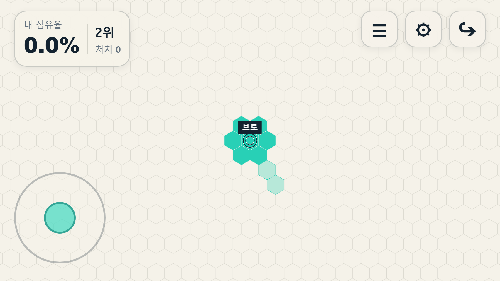
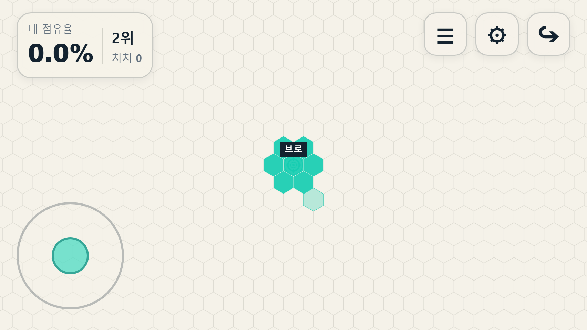

# 정식 적용 완료

사용자 승인으로 Ring / Target 개선안을 기본 디자인으로 적용했다. 이제 일반 게임과 production에서도 같은 도형을 사용하며 `experimentBasicContrast` 옵션은 제거했다. 게임·상점·프로필 미리보기에 공통 적용된다.

[일반 게임 열기](http://192.168.137.1:3003/)

아래는 승인 전 비교 실험 기록이다. 당시의 기존/실험 URL은 현재 모두 승인된 기본 디자인을 표시한다.

---

# Basic Ring / Target 대비 실험

정식 기본값은 변경하지 않았다. 개발/test에서 `experimentBasicContrast=1`을 지정한 경우에만 개선안을 사용한다. Production은 같은 옵션을 무시한다.

- 테스트: http://192.168.137.1:3003/?testMarkerGift=all&experimentBasicContrast=1&experimentSeed=4
- 기존 모습: http://192.168.137.1:3003/?experimentSeed=4
- 상점에서 Ring 또는 Target을 장착한 뒤 플레이한다. 테스트 옵션은 프로필/IndexedDB에 저장하지 않는다.

## 시각 변경

- Ring: 속은 그대로 비운다. 동일한 경로에 밝은 테두리(#FFFCF3), 어두운 경계(#142330), 선택 색상을 겹쳐 그린다. 본체 외경 48 world units.
- Target: 작은 내부 원을 제거하고, 바깥 원·십자선·중앙 점에 대비 경계를 추가한다. 십자선 양 끝의 간격 48 world units.
- 참가자 식별 링의 반경 25.5와 색상은 유지한다.
- 기본 Default / Hex / IMAGE 디자인, IMAGE 크기 48, 카메라 줌, 닉네임 표시는 그대로다.
- 동일한 도형 생성 함수를 게임·상점·프로필 미리보기에서 재사용한다. 테스트 옵션이 꺼지면 모두 기존 디자인이다.
- BOT의 Ring / Target에도 해당 화면의 테스트 옵션을 적용한다. 외형 동기화 protocol은 추가하지 않는다.

크기는 world units 기준이며 실제 CSS 픽셀 수는 기존 카메라 줌에 따른다. 영토 진입 여부에 따라 마커가 바뀌는 방식은 아니다.

## 데이터와 게임 규칙

Profile schema, Coins, 구매 소유권, reward, collision, capture, trail, slot, BOT AI는 수정하지 않았다. 실험 옵션을 바꿔도 simulation tick / owners / 참가자 ID 및 위치가 변하지 않는지 검사한다. 상점에서 일반적인 장착을 선택하면 기존 장착 저장 동작은 그대로 사용한다.

## 확인

- 관련 Core: 56개 통과 (실험 검사 6개 포함).
- client/server/test TypeScript 검사와 production build 통과.
- 브라우저 일반 링크 / 실험 링크 / production 차단: 3개 통과. 영토 중앙에서 멈춘 최종 비교 캡처도 일반/실험 두 경우 모두 통과했다. page error 0, 문서 세로 overflow 없음.
- 844×390 / 640×320 / 568×320, 모바일 touch / DPR 3 에뮬레이션.
- 실제 휴대폰에서의 시각 판단은 사용자의 테스트로 확인할 단계다.
- 원래 자동화 포트 5174가 Windows에서 EACCES를 반환하여, 허용된 임시 포트의 별도 로컬 설정으로 브라우저 검사를 실행했다. 실행 중인 LAN 서버는 바꾸지 않았다.

## 비교 화면

각 화면은 실제 게임 renderer에서 동일한 색상, 자기 시작 영토 중앙에 머리를 고정하여 캡처한다. 비교를 위한 위치/보호 해제는 브라우저 테스트 fixture에만 있고 production 우회 코드는 없다.

Ring 기존:

Ring 실험:

Target 기존:

Target 실험:

평가 후 채택 여부를 결정한다. 이 실험만으로 production 기본 디자인을 교체하지 않는다.

