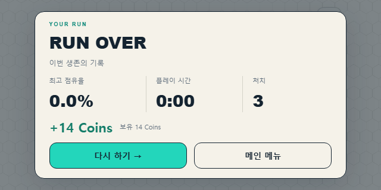
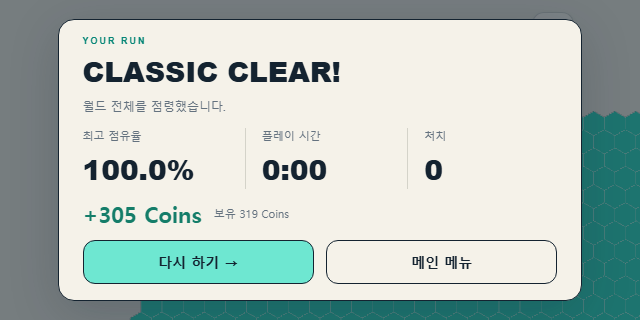

# Reward & Player Profile V1 결과

2026-10-06. 사용자 승인한 3가지 보완을 포함해 구현했다. 게임 상태·서버·프로토콜·RunResult는 변경하지 않았다. Practice와 온라인 모두 같은 클라이언트 보상 서비스를 사용한다.

## 보상과 통계

- Run 종료 결과를 관측하면 지급을 처리한다. 결과창 표시나 다시 하기 클릭은 지급 조건이 아니다.
- 최고 점유율 3.0% 이상 또는 1처치 이상 또는 FULL_CAPTURE_WIN일 때 기존 보상 공식을 적용한다. 최고 점유율 3.0% 미만·무처치·클리어가 아닌 Run은 0 Coins다. 시작 7칸에서 조금 확장해도 기준 미만이면 0 Coins이며 통계에는 한 번 기록한다.
- 총 보상 = 기본 5 + floor(최고 점유율 × 2) + 3 × 처치 + Classic 클리어 100. FULL_CAPTURE_LOSS에는 클리어 보너스가 없다.
- 점유율은 서버/로컬 엔진의 RunResult 값을 사용한다. 누적 획득량·생존 시간은 Coins를 늘리지 않는다.
- runsPlayed, classicClears, 실제 totalKills, bestTerritoryPercent, longestRunSeconds를 저장한다. 최장 시간은 durationTicks / simulationHz로 정규화한다.

| 최고 점유율 | 처치 | 종료 | Coins |
| --- | --- | --- | --- |
| 2.1% | 0 | DEATH | 0 |
| 3.0% | 0 | DEATH | 11 |
| 18.7% | 3 | DEATH | 51 |
| 46.2% | 8 | DEATH | 121 |
| 100% | 12 | FULL_CAPTURE_WIN | 341 |
| 100% | 12 | FULL_CAPTURE_LOSS | 241 |

## 저장과 중복 방지

- IndexedDB의 hexhold.player-profile / meta / profile에 버전 1 문서를 저장한다. Coins·통계·지급 기록은 하나의 readwrite 트랜잭션으로 갱신하며 commit 후에만 지급 완료를 표시한다.
- 최근 상세 기록은 256개다. 별도 월드/참가자 ledger의 observedLifeId와 paidLifeId로 상세 기록에서 빠진 과거 Run의 재지급도 막는다. 같은 월드의 다음 lifeId는 새 Run으로 지급한다.
- ALIVE Run을 관측했을 때만 지급 자격을 등록한다. 종료 결과만으로 미등록·폐기된 월드를 새로 등록하지 않는다. 이미 저장한 최근 결과는 재접속 시 지급 내역을 복원한다.
- 월드 ledger는 32개, 월드당 참가자는 최대 16명이다. 폐기된 월드만 제거하며 활성 지급 기록을 공간 확보 목적으로 지우지 않는다. 활성 ledger만으로 32개가 찬 경우 저장 실패로 처리한다.
- 탭의 소유 식별자는 sessionStorage로 새로고침 동안 유지한다. 메뉴/새 월드 이동은 기존 월드를 닫고, 같은 탭의 새 월드 등록은 이전 월드를 정리한다.
- 다른 탭의 지급도 IndexedDB가 순서대로 처리한다. BroadcastChannel은 저장된 잔액 변경을 UI에 전달한다.
- 저장 실패는 성공으로 표시하지 않는다. 결과창에 저장 실패/저장 재시도를 표시하며 게임 재시도는 가능하다. 저장소 접근 복구 또는 일시적 write 실패 복구 뒤 저장 재시도가 가능하다.
- 잘못된 버전·음수·비정상 스키마·문자열 레코드는 제한된 단일 corrupt-backup에 보관하고 빈 프로필로 복구한다. 읽을 수 없는 손상 기록의 잔액·지급 이력을 추측해서 재구성하지 않는다.
- 프로필은 해당 브라우저와 origin에 저장한다. 저장 데이터 삭제나 다른 주소/브라우저 사용은 별도 프로필이다. XP·레벨·상점·광고·서버 경제는 추가하지 않았다.

## UI와 영토 생성 효과

결과창은 기존 점유율·시간·처치 옆에 +N Coins와 보유 잔액을 표시한다. 메뉴에는 작은 잔액만 추가했다. 전체 프로필 페이지나 긴 보상 상세 표는 넣지 않았다.

이미 적용 승인된 Capture Pulse는 운영과 개발 모두 기본 ON이다. URL 옵션이 없어도 중립 셀 획득과 상대 영토 탈취에 기존 Pulse가 적용된다. development/test에서 experimentCaptureEffect=none으로만 끌 수 있다. 기존 pulse/bloom 링크는 같은 Pulse를 사용한다. 이번 변경은 효과의 기본 활성화 설정이며 렌더러·전파 방식·영토 판정은 변경하지 않았다.

## 초기 V1 검증

- npm test: 68개 파일 / 340개 테스트 통과. 신규 보상 단위 테스트 14개 포함. 실제 엔진 Run 두 번에 보상을 적용해도 MatchState가 변경되지 않는 검사를 포함한다. 기존 게임/서버 회귀 테스트도 통과했다.
- npm run build: 클라이언트·서버·테스트 타입 검사 및 운영 빌드 통과. 기존 Phaser 번들 크기 경고는 남아 있다.
- npm run test:run: 11개 검증 대상으로 Classic-only, 오프라인 Practice, 가로/세로 화면, 같은 월드 재시도, 클리어 후 새 월드, 보상/저장/재접속을 확인했다. 전체 실행은 10개 통과 후 마지막 온라인 테스트가 60초 제한에 걸렸다. 온라인 테스트 단독 재실행은 통과했다(19.0초).
- 마지막 저장 복구 보완 후 reward.spec.ts 4개 전체 재실행 통과(48.6초). 실제 서로 다른 탭의 동시 지급, 새로고침 지속성, 256개 상세 내역 이후 dedup, 손상 복구, quota 실패 전체 롤백, 복구 후 재지급, 저장소 접근 복구 후 UI 저장 재시도를 확인했다.
- 온라인 실제 Socket.IO 연결 종료/재접속: 동일 Run의 +14 Coins 유지, 누적 잔액 14와 runsPlayed 1 유지, 같은 월드 lifeId 2 재시도 확인.
- 844×390 / 640×320에서 결과 정보·Coins·두 버튼이 화면 안에 있고 문서 세로 스크롤이 없는 것을 확인했다. 스크린샷도 직접 확인했다.
- 운영 빌드 http://127.0.0.1:3001/에서 옵션 없이 CAPTURE_PULSE / 16 참가자 / 페이지 오류 없음 확인.
- PC에서 모바일 LAN 주소 http://192.168.137.1:3003/로 접속: HTTP 200, CAPTURE_PULSE / 16 참가자 / 페이지 오류 없음 확인. WebSocket CONNECTED 및 protocolVersion 5 session:ready 확인. 핫스팟 재활성화 직후 주소 변경 오류가 있어 HTTP 준비 확인 후 재검증했다.

로컬 원본 로그: .local/reward-full-tests.json, .local/reward-build-final.log, .local/reward-browser-final.log, .local/reward-online-confirmed.log, .local/reward-retry-confirmed.log.

## 화면

## MANUAL REQUIRED

실제 휴대폰의 터치 조작, 앱 전환/백그라운드 복귀, 브라우저를 완전히 닫았다 연 뒤의 저장 지속성, 기기별 Coins 글자 크기와 Pulse 체감은 수동 확인이 필요하다. PC의 모바일 화면 에뮬레이션과 LAN 접속 검증을 실제 휴대폰 테스트로 간주하지 않았다. 이 작업에서 새 장시간 성능 벤치마크는 수행하지 않았다.

## 최소 파밍 방지 수정 — 2026-10-06

보상 자격을 최고 점유율 1.0% / 1처치 / Classic 클리어의 OR 조건으로 변경하고, 사용자 요청에 따라 킬 보상 상한을 20킬(최대 60 Coins)로 올렸다. 나머지 계산식은 유지한다. 처치로 자격을 통과한 경우도 기존 점유율 항을 유지하므로 0.9%·1킬은 5 + floor(0.9 × 2) + 3 = 9 Coins이고, R56 시작 영토의 0.0%·1킬은 8 Coins다. R56에서 95칸은 표시 점유율 0.9%로 자격 미달이고 96칸은 1.0%로 통과한다. PlayerProfile·IndexedDB·runId dedup·same-world retry·게임 규칙·UI 구조에는 변경이 없다. 기존 지급 이력과 잔액은 소급 변경하지 않는다.

이번 수정 검증: 보상 테스트 26개 포함 전체 68개 파일 / 352개 테스트 통과. 전체 타입 검사와 운영 build 통과. 보상 자격 0.9%/1.0% 경계, 실제 R56의 7/8/95/96칸, 처치로 자격 통과, 19/20/21/100킬 상한, Classic 클리어, 서로 다른 runId로 한 칸 확장을 반복해도 누적 0 Coins인 사례를 검증했다. 보호 대상 9개 소스 파일의 작업 전후 SHA-256이 동일하며 저장·중복 지급·게임·UI 연결부를 수정하지 않았다. 전체 테스트 원본은 .local/reward-eligibility-full.json에 있다.

## 최소 점유율 3% 조정 — 2026-10-06

사용자 요청으로 minimumTerritoryPercent만 1.0에서 3.0으로 변경했다. 1처치 또는 FULL_CAPTURE_WIN 조건, 킬 상한 20, 기존 계산식과 저장 구조는 유지한다. R56은 287칸이 2.9%로 미달, 288칸부터 3.0%로 보상 자격을 통과한다. 정상 유상 Run을 사용하는 dedup/저장 회귀 테스트의 입력만 3.0%로 갱신했다. 과거 지급 기록과 잔액은 소급 변경하지 않는다.

3% 변경 검증: 전체 68개 파일 / 353개 테스트(보상 27개 포함), 타입 검사 및 운영 build 통과. 갱신한 IndexedDB/다중 탭 브라우저 회귀 2개 통과(24.8초). 런타임 변경은 minimumTerritoryPercent 값 하나이며 원본 로그는 .local/reward-three-percent-full.json 및 .local/reward-three-percent-browser.log에 있다.

## 2026-10-07 킬 보상 상한 해제

사용자 요청으로 20킬 상한을 제거했다. 이제 모든 처치에 기존 3 Coins를 지급한다. 예: 21킬은 킬 보상 63 Coins, 100킬은 300 Coins다. 100% Classic 클리어 + 30킬은 총 395 Coins다. 3% / 1킬 / FULL_CAPTURE_WIN 보상 자격, 기본 5, 점유율 항, 완주 100, RunResult, 프로필/IndexedDB schema와 runId/world 중복 지급 방지는 유지한다. 과거 지급 영수증과 잔액은 재계산하거나 소급 지급하지 않는다. 20킬 초과 지급·저장·중복 방지와 과거 영수증 보존을 검증한다.
이번 수정 검증: 전체 77개 파일 / 449개 테스트, typecheck 및 production build 통과. 실행 중인 3003 클라이언트가 상한 없는 새 계산식을 제공하는 것도 확인했다.
